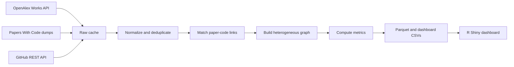

# FedAtlas

Mapping the Global Research-to-Code Ecosystem of Federated Learning.

FedAtlas is a real-data pipeline and R Shiny dashboard for studying Federated Learning research from 2016-2026. It combines OpenAlex publications, Papers With Code links, GitHub repository metadata, venue quality annotations, and network analytics.

## Research Questions

- How fast is Federated Learning growing across papers, citations, venues, and topics?
- Which countries, institutions, authors, and venues are most influential?
- How does global collaboration structure evolve?
- Which topics have strong or weak GitHub implementation coverage?
- Where are the largest research-to-code gaps?

## Architecture



## Setup

```bash
copy .env.example .env
```

Edit `.env` and set at least:

```text
OPENALEX_MAILTO=your-email@example.com
GITHUB_TOKEN=your_github_token
```

Then run:

```bash
make setup
make smoke
```

Install R separately if it is not already available, then install dashboard packages:

```r
install.packages(c(
  "shiny", "bslib", "shinyWidgets", "shinycssloaders", "plotly",
  "leaflet", "leaflet.extras", "DT", "visNetwork", "networkD3", "dplyr", "tidyr", "readr",
  "arrow", "stringr", "lubridate", "htmltools", "scales", "jsonlite"
))
```

## Run the Real Pipeline

```bash
make crawl
make build
make dashboard
```

For local smoke development:

```bash
set MAX_PAPERS=200
make crawl
make build
```

For a larger class demo:

```bash
set MAX_PAPERS=5000
make crawl
make build
```

`MAX_PAPERS=0` means no artificial cap. The crawler still uses cursor pagination, caching, and polite retries.

## Venue Quality

FedAtlas does not scrape paywalled or restricted ranking data and does not invent A*/A/Q1 labels. Start from the template:

```text
config/venue_quality.csv
```

Import a legally usable CSV:

```bash
python scripts/import_venue_quality.py path/to/venue_quality_source.csv --output config/venue_quality.csv
```

Unknown venues are retained and shown in the Venues & Quality tab for manual review.

## Weekly Update

`.github/workflows/weekly_update.yml` runs every Monday at 06:00 UTC and reads:

- `OPENALEX_API_KEY`
- `OPENALEX_MAILTO`
- `GITHUB_TOKEN`

The workflow restores raw caches, runs `scripts/08_weekly_update.py`, rebuilds processed data, writes `data_quality_report.md`, and uploads processed data as an artifact. It commits processed data only when repository variable `COMMIT_PROCESSED_DATA=1`.

## Data Outputs

Normalized parquet tables and dashboard CSVs are written under `data/processed`. See [docs/data_dictionary.md](docs/data_dictionary.md) for field-level notes.

## Dashboard

The dashboard lives under `dashboard/` and is written in R Shiny. It includes Overview, Global Collaboration, Topic Evolution, Network Explorer, Research-to-Code Gap, Repositories & Contributors, Venues & Quality, and Data & Methods tabs.

Launch it with:

```bash
make dashboard
```

## Deploy to shinyapps.io

Create a shinyapps.io account, then open Account > Tokens and copy the `rsconnect::setAccountInfo(...)` values into environment variables:

```bash
set SHINYAPPS_ACCOUNT=your-account-name
set SHINYAPPS_TOKEN=your-token
set SHINYAPPS_SECRET=your-secret
set SHINYAPPS_APP_NAME=fedatlas
```

Build the processed data first, then deploy:

```bash
make build
make deploy-shinyapps
```

The deploy script creates a temporary self-contained bundle with `dashboard/` plus the required `data/processed` outputs. It does not commit processed data or credentials to Git.

## Limitations

- GitHub metadata enrichment is rate-limited without `GITHUB_TOKEN`.
- OpenAlex venue quality is not equivalent to A*/A/Q1; those labels require user-supplied quality data.
- Papers With Code coverage is incomplete and biased toward ML papers with public implementations.
- Institution-country metadata depends on OpenAlex authorship affiliations.
- Very large graphs are aggregated or filtered in the dashboard for performance.

## Troubleshooting

- If `make smoke` fails on missing Python packages, run `make setup`.
- If OpenAlex returns zero records, check network access and `OPENALEX_MAILTO`.
- If GitHub enrichment is sparse, set `GITHUB_TOKEN`.
- If the dashboard will not launch, confirm `Rscript` is on PATH and the listed R packages are installed.
- If data files become too large for Git, use Git LFS or GitHub release artifacts.

## Demo

See [docs/demo_script.md](docs/demo_script.md) for a 3-5 minute presentation script.
